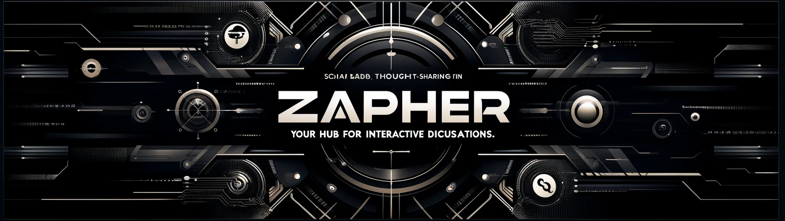
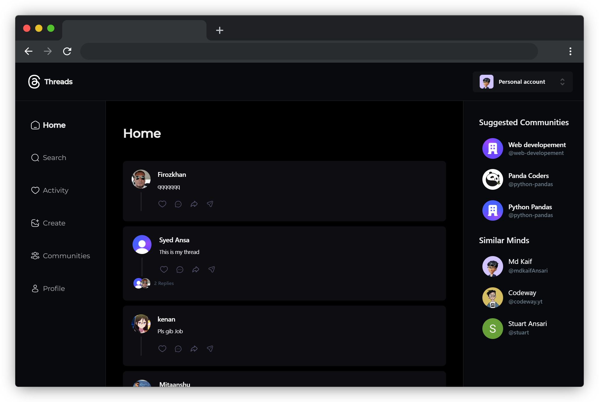

# Zapher - Your Hub for Interactive Discussions

Zapher is a dynamic web application that brings discussions to life using cutting-edge technologies such as Next.js 14, MongoDB, and Clerk for authentication. From its humble beginnings, Zapher has evolved into a robust platform featuring optimized architecture, polished code, and a sleek UI. Join the conversation seamlessly and explore the world of interactive discussions!

## ⚡ Project Status

## 🏆 Featured in:

<table>
    <tr>
      <th>Event Logo</th>
      <th>Event Name</th>
      <th>Event Description</th>
    </tr>
    <tr>
        <td></td>
        <td>GirlScript Summer of Code 2024</td>
        <td>GirlScript Summer of Code is a three-month-long Open Source Program conducted every summer by GirlScript Foundation. It is an initiative to bring more beginners to Open-Source Software Development. <a href="docs/gssoc.md">Click here</a> to get the guidelines.  </td>
    </tr>
</table>

## Table of Contents

- [Why Open Source?](#-why-open-source)
- [Technology Used](#-technology-used)
- [Live Demo](#live-demo-)
- [Introduction](#-introduction)
- [What does it do?](#-what-does-it-do)
  - [Features](#features)
  - [Benefits](#benefits)
- [License](#%EF%B8%8F-license)
- [How to Contribute?](#-how-to-contribute)
  - [Setup](#setup)
- [Top Contributors](#-top-contributors)
- [Support](#-support)

## 🤔 Why Open Source?

Contributing to open source provides immense opportunities to work on diverse projects and with various mentors, gaining unique insights and ideas. It’s a platform where contributors grow together with a constructive and positive attitude.

This repository aims to provide such a platform, allowing contributors to bring innovative ideas for interactive discussions and make our application better.

<h5 align="center"><i>If you like the project, please <a href="https://github.com/mdkaifansari04/Zapher/stargazers">★</a> this repository to show your support! 🤩</i></h5>

## 🚀 Technology Used

  
  
  
  
  
  
  
  
  
  
  
  

- [Next.js 14](https://nextjs.org) - A React framework for building web applications with server-side rendering.
- [MongoDB](https://www.mongodb.com) - A NoSQL database for modern web applications.
- [Clerk](https://clerk.dev) - User management and authentication service.
- [Tailwind CSS](https://tailwindcss.com) - A utility-first CSS framework for rapidly building custom user interfaces.

## Live Demo 💻

### Visit [Zapher Live](https://zapher.vercel.app/sign-in) to see the live demo!

 
 

## 👋 Introduction

Zapher is a social media platform designed for seamless and interactive discussions. Leveraging modern web technologies, it provides users with a sleek interface and robust functionality for community building and engagement.

## 🔨 What does it do?

Zapher enables users to create and participate in vibrant communities. Users can share their thoughts, post updates, and engage in meaningful conversations. The platform supports various features to enhance user experience and foster engagement.

### Features

- **User Authentication**: Secure authentication using Clerk.
- **Responsive Design**: Fully mobile-responsive to ensure accessibility across devices.
- **User Search**: Easily find and connect with other users.
- **Notifications**: Stay updated with activities in the notification tab.
- **Community Creation**: Create communities, assign admin roles, and invite users via email.
- **Profile Management**: View and manage your posts, activities, and more in your profile tab.
- **Content Interaction**: Create posts, comment on others’ posts, and explore different communities.

### Benefits

- **Enhanced Connectivity**: Connect and interact with like-minded individuals.
- **Improved Collaboration**: Collaborate within communities to share ideas and insights.
- **User-Friendly Interface**: An intuitive and polished user interface for a seamless experience.
- **Growth Opportunities**: Engage with a wider audience and grow your network.

## 🛡️ License

Zapher is licensed under the MIT License - see the [LICENSE](LICENSE) file for details.

## 🤔 How to Contribute?

Contributing to open-source software (OSS) projects is a rewarding experience. It allows you to learn new skills and make valuable contributions to the community.

- Read our [Code of Conduct](CODE_OF_CONDUCT.md) before contributing.
- Follow the [Git Workflow](docs/git.md) for best practices.
- Check the [Contribution Guidelines](CONTRIBUTING.md) for detailed instructions.
- Create an [issue](https://github.com/mdkaifansari04/Zapher/issues) to report bugs or suggest new features.
- Ensure your commits have descriptive messages.

### Setup

- [Setting up a development environment](docs/setup.md)
- [Setting up Clerk](docs/clerk.md)

## ✨ Top Contributors

A big thank you to our top contributors who have significantly improved Zapher. Your hard work and dedication are truly appreciated! 🌟😄

## 🙏🏽 Support

This project needs your support! Please star 🌟 this repository to show your appreciation.
